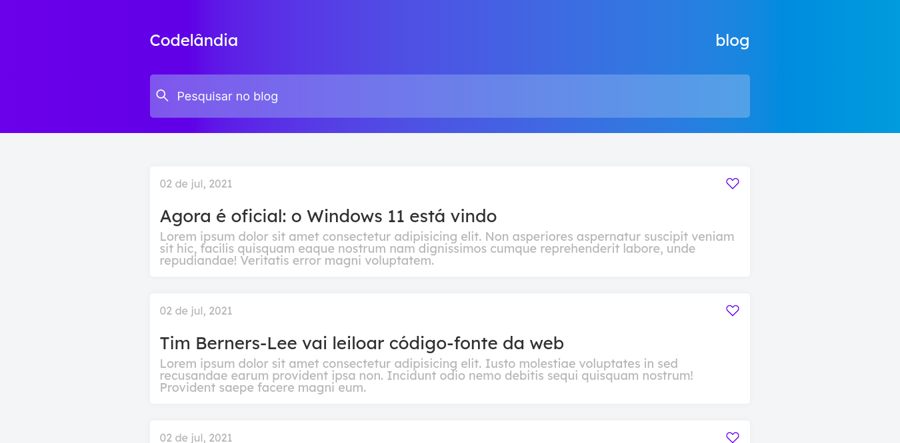
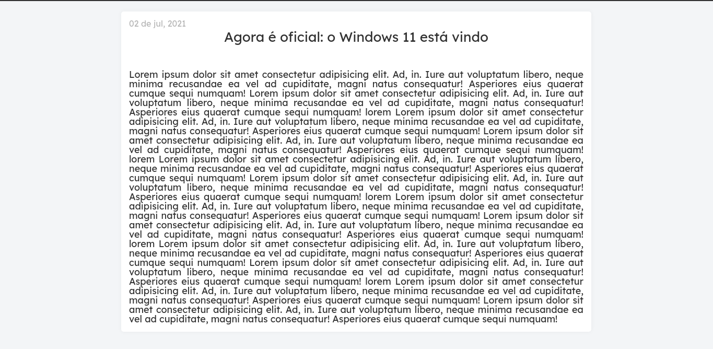
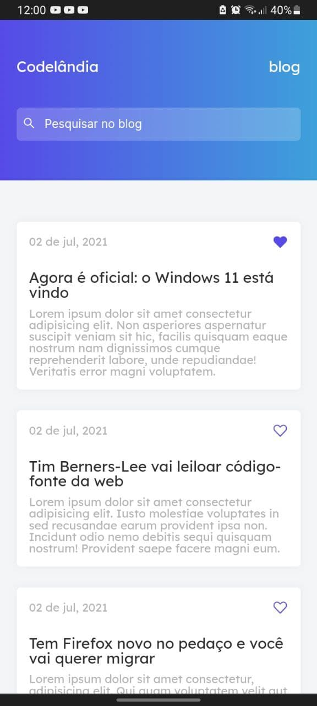
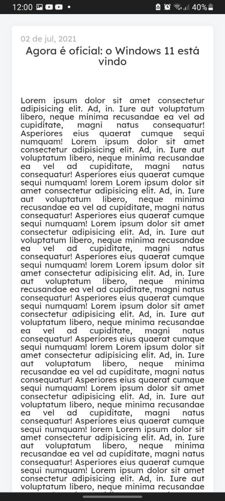

# Nome do projeto



## About this project
This project is part of my personal portfolio, it is a challenge taken from the codelândia community on discord.
[Figma Link](https://www.figma.com/file/Yb9IBH56g7T1hdIyZ3BMNO/Desafios---Codel%C3%A2ndia)

## Getting Started
### Installing
**Cloning the repository**
```
$git clone https://github.com/RenanTRS/codelandia-blog.git
$cd codelandiablog
```
**Installing dependencies**
```
$yarn
```
or
```
$npm install
```
## Running
With all dependencies installed and the environment properly configured, you cannow run the project:
```
$yarn start
```
or
```
$npm start
```
## Built With
- [TypeScript](https://www.typescriptlang.org/)
- [Styled-Components](https://styled-components.com/)
- [React router dom](https://v5.reactrouter.com/web/guides/quick-start)

---
Email me - renantrsouza@gmail.com  
Connect with me on [Linkedin](https://www.linkedin.com/in/renantrsouza/)